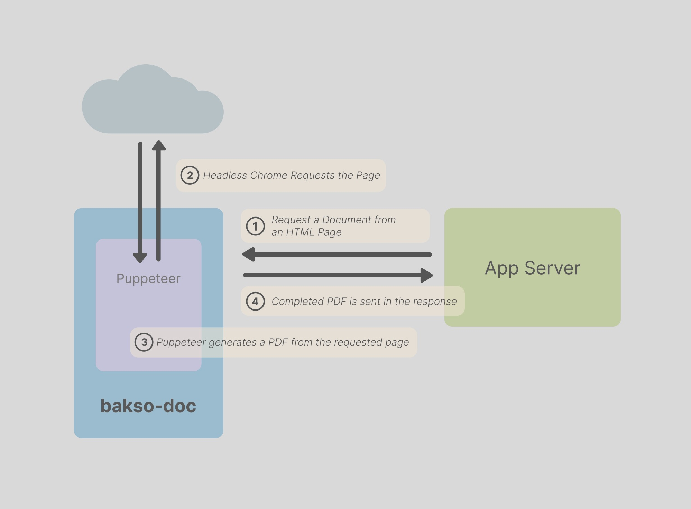

# bakso-doc

   


### `bakso-doc` is a Node.js micro-service that creates PDF documents.

It uses [Puppeteer](https://www.npmjs.com/package/puppeteer) and headless Chrome to request an HTML document and create a PDF.

### Features:
- Simpler that propietary PDF-building syntaxes. Just use HTML & CSS.
- Simple stateless architecture
- Easy to setup

<br/>

## Menu

- [Architecture](#architecture)
- [CSS Styles for PDFs](#print-stylesheet-use-html--css-to-create-documents)
- [Get Started](#get-started)
- [Delpoyment](#deployment)
- [Error Monitoring](#error-monitoring)
- [Examples](#examples)

<br/>

## Architecture



1. Originating app server requests a PDF document.
   1. The request contains the URL of an HTML page.
2. `bakso-doc` uses Puppeteer to request the HTML page.
3. [`Page.pdf`](https://pptr.dev/api/puppeteer.page.pdf/) method is called to generate a PDF document from the HTML page.
4. The entire PDF document is sent back in the response to the originating server.

<br/>

### Synchronous Requests
`bakso-doc` runs synchronously. When a document is requested, the request does not finish until the entire document is sent back. It is meant to be used in a queue system where the length of time to complete a request is not important.

`bakso-doc` is agnostic to other parts of the document processing system.

### Page Request
Because Puppeteer/Chrome makes the requests diectly by setting the page URL, only GET requests can be made to the document page. You must pass any parameters in the URL query string.

### Auth

In the interest of keeping server auth simple and easy to setup, `bakso-doc` authorizes requests with [JWT tokens](https://www.npmjs.com/package/jsonwebtoken). The default is to generate a [long-lived token](https://github.com/awongh/bakso-doc/blob/main/src/token.js#L6) for use on the requesting server.

Optionally, the secret can be shared across services and used to both sign and verify the tokens.

<br/>

## Print Stylesheet: Use HTML & CSS to Create Documents 

CSS provides a powerful set of media queries and styles to be able to style a document.
```CSS
@page {
  size: A4 landscape;
}
```

https://developer.mozilla.org/en-US/docs/Web/CSS/CSS_media_queries/Printing

https://www.smashingmagazine.com/2011/11/how-to-set-up-a-print-style-sheet/

<br/>

## Get Started

Clone the repo:
```bash
$ git clone https://github.com/awongh/bakso-doc.git && cd bakso-doc
```

Install deps:
```bash
npm i
```

Generate the secret and set it in the `.env` file:
```bash
$ touch .env &&
echo "BAKSO_SECRET_KEY=\"$( node -e "console.log(require('crypto').randomBytes(256).toString('base64'));" )\"" >> .env
```

Generate a requesting token:
```bash
$ npm run generate_token <SECRET GOES HERE>
```

## Generate a simple PDF Document

Set the requesting token in the `Authorization` request header.

Use cURL to make the request and download the file- create a test file called `test.pdf` in the current directory.

```bash
$ TEMP_TOKEN=$(npm run generate_token "<YOUR SECRET HERE>" | tail -n 1) &&
curl -X POST -H "Authorization: ${TEMP_TOKEN}" -H "Content-Type: application/json" --output test.pdf -d '{"pdfParams":{"renderUrl":"https://example.com"}}' http://localhost:5003/download/pdf
```
<br/>

### Params
See the [schemas.js](https://github.com/awongh/bakso-doc/blob/main/src/schemas.js) file to see the full accepted request params.

#### PDF Options
See the PDF options as [defined by Pupeteer.](https://pptr.dev/api/puppeteer.pdfoptions)

Example:
```JSON
{
  "name":"myfile",
  "renderUrl":"https://localhost:3000/mydoc",
  "pdfOptions":{
    "width":"8.5in",
    "height":"11in",
    "printBackground":true
  }
}
```

<br/>

## Deployment

#### render.com

For deployment on [render.com](https://www.render.com) see the [render.com branch.](https://github.com/awongh/bakso-doc/tree/render.com)

<br/>

## Error Monitoring

Error monitoring with [Sentry](https://sentry.io) is already setup.

Add your Sentry DSN to the `.env` file:
```bash
BAKSO_SENTRY_DSN='<YOUR SENTRY DSN>'
```

## Examples

Checkout the examples directory.

#### Birthday Card Document Server
Express server that creates a customized 8½x11 birthday card.

[Express server](./examples/card-example/README.md) that creates a customized 8½x11 birthday card.

